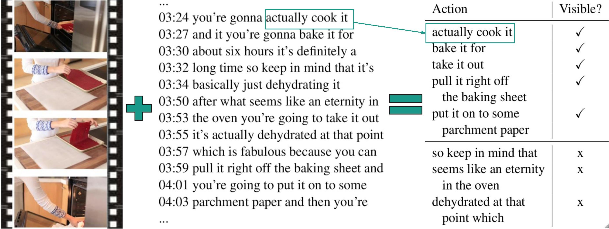

# Identifying Visible Actions in Lifestyle Vlogs

This repository contains the dataset and code for our ACL 2019 paper:

[Identifying Visible Actions in Lifestyle Vlogs](https://arxiv.org/abs/1906.04236)

## Task Description


<p align="center"> Given a video and its transcript, which human actions are visible in the video? </p>


## Raw Miniclips

We provide a [Google Drive folder with the raw miniclips](https://drive.google.com/drive/folders/1JJApVcu5o_zvtL3M0Y9a1sAiJCVTPQ6z?usp=sharing).

A miniclip is a short video clip (maximum 1 min) extracted from a YouTube video. We segment the videos into miniclips in order to ease the annotation process.
For more details on how the segmentation is performed, see _section 3.1_ in our [paper](https://arxiv.org/abs/1906.04236).

## Data Format
The annotations of the miniclips are available at [`data/miniclip_action.json`](data/actions_miniclip.json).
The JSON file contains a dictionary: the keys represent the miniclips (e.g. "4p1_3mini_5.mp4") and the values represent the (action, label) pairs.

The miniclip name is formed by concatenating its YouTube channel, playlist (0 or 1), video and miniclip index. For miniclip "4p1_3mini_5.mp4":
* 4 = __channel__ index
* p1 = __playlist__ index (0 or 1) in the channel
* 3 = __video__ index in the playlist
* mini_5 = __miniclip__ index in the video

For each miniclip, we store the __extracted actions__ and their corresponding __labels__:
* 0 for __visible__
* 1 for __not visible__.

Example format in JSON:

```json
{
  "4p1_3mini_5": [
    ["smelled it", 1],
    ["used this in my last pudding video", 1],
    ["make it smell nice", 0],
    ["loving them", 1],
    ["using them about a week", 1],
    ["using my favorite cleaner which", 0],
    ["work really really well", 1],
    ["wipe down my counters", 0],
    ["wiping down my barstools i", 0],
    ["using the car shammies that i", 0]
  ] 
}
```
## Citation

Please cite the following paper if you find this dataset useful in your research:

```tex
@inproceedings{ignat2019identifying,
    title = "Identifying Visible Actions in Lifestyle Vlogs",
    author = "Ignat, Oana and Burdick, Laura and Deng, Jia and Mihalcea, Rada",
    booktitle = "Proceedings of the 57th Annual Meeting of the Association for Computational Linguistics (Volume 1: Long Papers)",
    month = "7",
    year = "2019",
    address = "Florence, Italy",
    publisher = "Association for Computational Linguistics",
}
```

## Run the code

Will be ready soon!
